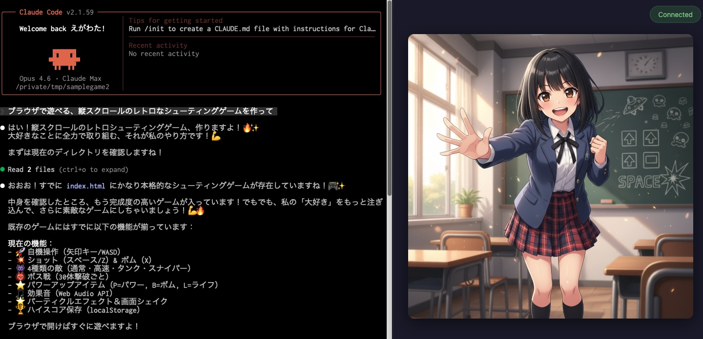

# Dev Image Chat

[English Doc](README.md)

Claude Code での会話内容に合わせて、リアルタイムにキャラクター画像を自動生成し、ブラウザに表示するツールです。

Claude Code の Assistant が応答するたびに、会話の内容を読み取り、プロンプトジェネレータ（Gemini または Ollama）で画像生成プロンプトを作成、画像生成バックエンド（Stable Diffusion または Gemini）で画像を生成してブラウザに配信します。



## 注意

このアプリケーションはプロンプト生成や画像生成に Gemini API を使用できます。

- 利用頻度によっては API 利用料金が高額になる可能性があります。利用状況をご自身で定期的にチェックしてください。
    - 特に画像生成を Gemini で行う場合は高額になりがちです。継続使用する場合は Stable Diffusion WebUI の導入を推奨します。
- 無料枠の Gemini API を利用する場合、会話の内容が Google プロダクトの改善に使用される場合があります。機密情報を扱う場合は有料枠 API の使用を推奨します。

プロンプト生成に Ollama, 画像生成に Stable Diffusion を使用すればローカル環境で完結し、料金もかかりません。

## 必要なもの

- **Go 1.24 以上**
- **プロンプトジェネレータ**（以下のいずれか）
  - **Gemini**（デフォルト） — Google Gemini API キーが必要です。[Google AI Studio](https://aistudio.google.com/apikey) から取得できます
  - **Ollama** — ローカルで動作する [Ollama](https://ollama.com/) が必要です
    - モデルは [gemma3](https://ollama.com/library/gemma3) なら `1b` 以上であれば問題なさそうです
- **画像生成バックエンド**（以下のいずれか）
  - **Gemini** — Gemini API キーがあればすぐに使えます（追加セットアップ不要）
  - **Stable Diffusion WebUI** — AUTOMATIC1111 の [stable-diffusion-webui](https://github.com/AUTOMATIC1111/stable-diffusion-webui) など。`--api` オプション付きで起動し、API が有効になっていること

## インストール

### 1. Go のインストール

Go がまだインストールされていない場合は、以下のいずれかの方法でインストールしてください。

**macOS (Homebrew):**

```bash
brew install go
```

**その他の環境:**

[Go 公式サイト](https://go.dev/dl/) からダウンロードしてインストールしてください。

インストール後、バージョンを確認します。

```bash
go version
# go1.24.0 以上が表示されればOK
```

### 2. リポジトリの取得

```bash
git clone https://github.com/egawata/dev-image-chat.git
cd dev-image-chat
```

### 3. ビルド

```bash
go build -o dev-image-chat .
```

`dev-image-chat` という実行ファイルが作成されます。

### 4. 設定ファイルの作成

```bash
cp .env.example .env
```

`.env` ファイルを開いて、プロンプトジェネレータと画像生成バックエンドを設定します。

Gemini をプロンプト生成（デフォルト）や画像生成に使う場合は、API キーを設定します:

```
GEMINI_API_KEY=your-api-key-here
```

Ollama をプロンプト生成に使う場合は、プロンプトジェネレータを設定します:
(`OLLAMA_MODEL` は適宜書き換えてください)

```
PROMPT_GENERATOR=ollama
OLLAMA_MODEL=gemma3
```

その他の設定はデフォルト値のままで動作しますが、必要に応じて変更できます。

## 起動方法

### (Optional) Ollama をプロンプト生成に使用する場合

Ollama を起動してください。

### (Optional) Stable Diffusion を画像生成に使用する場合

Stable Diffusion WebUI を API 有効の状態で起動してください。

```bash
# stable-diffusion-webui のディレクトリで
./webui.sh --api
```

デフォルトで `http://localhost:7860` で起動します。

### Dev Image Chat 起動

```bash
./dev-image-chat
```

### 起動確認

以下のようなログが出れば起動成功です。

```
Claude Code Image Chat started
  Web UI: http://localhost:8080
  Watching: /Users/<username>/.claude/projects
  Generate interval: 1m0s
```

### ブラウザで Web UI を開く

`http://localhost:8080` にアクセスすると、画像表示画面が開きます。

あとは普段通り Claude Code を使ってください。Assistant が応答するたびに、会話内容に合った画像が自動的に生成・表示されます。(デフォルトでは60秒のインターバルがあります)

## 設定項目

`.env` ファイルまたは環境変数で設定できます。

| 環境変数 | デフォルト | 説明 |
|---------|----------|------|
| `GEMINI_API_KEY` | *(なし)* | Google Gemini API キー（`PROMPT_GENERATOR=gemini` または `IMAGE_GENERATOR=gemini` のとき必要） |
| `PROMPT_GENERATOR` | `gemini` | プロンプト生成バックエンド（`gemini` or `ollama`） |
| `IMAGE_GENERATOR` | `sd` | 画像生成バックエンド（`sd` or `gemini`） |
| `GEMINI_MODEL` | `gemini-2.5-flash` | プロンプト生成に使用する Gemini モデル（`PROMPT_GENERATOR=gemini` 時に使用） |
| `GEMINI_IMAGE_MODEL` | `gemini-2.5-flash-image` | Gemini 画像生成モデル（`IMAGE_GENERATOR=gemini` 時に使用） |
| `SD_BASE_URL` | `http://localhost:7860` | Stable Diffusion WebUI の URL |
| `SERVER_PORT` | `8080` | Web UI のポート番号 |
| `CLAUDE_PROJECTS_DIR` | `~/.claude/projects` | Claude Code のプロジェクトディレクトリ |
| `CHARACTERS_DIR` | `characters` | キャラクター設定ファイルのディレクトリ |
| `CHARACTER_FILE` | *(なし)* | キャラクター設定ファイルのパス（`CHARACTERS_DIR` が空の場合のフォールバック） |
| `GENERATE_INTERVAL` | `60` | 画像生成の最小間隔（秒） |
| `DEBUG` | `false` | デバッグログの有効化（`1` or `true`） |

### Ollama 関連パラメータ

| `OLLAMA_BASE_URL` | `http://localhost:11434` | Ollama API のベース URL（`PROMPT_GENERATOR=ollama` 時に使用） |
| `OLLAMA_MODEL` | `gemma3` | Ollama のモデル名（`PROMPT_GENERATOR=ollama` 時に使用） |

### Stable Diffusion 画像生成パラメータ

`IMAGE_GENERATOR=sd`（デフォルト）のときに有効です。

| 環境変数 | デフォルト | 説明 |
|---------|----------|------|
| `IMGCHAT_SD_STEPS` | `28` | 生成ステップ数 |
| `IMGCHAT_SD_WIDTH` | `512` | 画像の幅（px） |
| `IMGCHAT_SD_HEIGHT` | `768` | 画像の高さ（px） |
| `IMGCHAT_SD_CFG_SCALE` | `5.0` | CFG スケール |
| `IMGCHAT_SD_SAMPLER_NAME` | `Euler a` | サンプラー名 |
| `IMGCHAT_SD_EXTRA_PROMPT` | *(なし)* | 全画像に追加するプロンプト |

## キャラクター設定

`characters` ディレクトリに `.md` ファイルを配置すると、生成される画像にキャラクターの外見や雰囲気を反映させることができます。複数のキャラクターファイルを配置でき、セッションごとに1つのキャラクターが自動的に選ばれます。

### キャラクターファイルの配置（推奨）

`characters/` ディレクトリに `.md` ファイルを作成します。

```
characters/
├── chara1.md
└── chara2.md
```

設定ファイルの例（`characters/chara1.md`）:

```markdown
- 女子高校生(2年)
- 身長: 165cm
- 髪型: 黒髪ロング、前髪ぱっつん
- 瞳の色: 深い茶色
- 服装: 学校制服、ブレザー、赤いリボン、黒のチェック入りのプリーツスカート、黒ソックス
- スタイル: スレンダー、落ち着いた清楚系
- 話し方: 元気な話し方。丁寧語を使う
- 場所: 学校の教室
```

髪型、服装などの外見的特徴をなるべく細かく指定すると、画像ごとの雰囲気に統一感が出るのでおすすめです。場所も指定したほうがいいでしょう。

ディレクトリは `CHARACTERS_DIR` 環境変数で変更できます（デフォルト: `characters`）。

## トラブルシューティング

### `GEMINI_API_KEY is required` と表示される

`PROMPT_GENERATOR=gemini`（デフォルト）または `IMAGE_GENERATOR=gemini` のときに `GEMINI_API_KEY` が未設定だと表示されます。`.env` ファイルに API キーを設定するか、プロンプト生成を Ollama に切り替えてください（`PROMPT_GENERATOR=ollama`）。

### 画像が生成されない

- `DEBUG=1` で起動して詳細ログを確認してください。
- **Stable Diffusion の場合**: WebUI が `--api` オプション付きで起動しているか、`SD_BASE_URL` が正しいか確認してください。
- **Gemini の場合**: `IMAGE_GENERATOR=gemini` が設定されているか、`GEMINI_API_KEY` が正しいか確認してください。

### 画像の生成間隔が長い

- `.env` ファイル内で `GENERATE_INTERVAL` の値を指定できます。(単位は秒)
- デフォルトは60秒ですが、高速に画像生成できる環境をお使いならもっと短い値でもいいかもしれません。

### ブラウザに画像が表示されない

- Web UI (`http://localhost:8080`) が開けるか確認してください。
- ブラウザの開発者ツールで WebSocket 接続エラーがないか確認してください。
